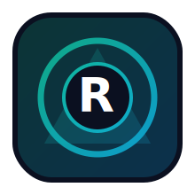

# Resonvyr

<p align="center">
  
</p>


[](https://ko-fi.com/smouj013_dev)

<p align="center">
  <a href="./README.md"></a>
  <a href="./README.es.md"></a>
</p>

**Voice-to-task automation pipeline for local control.**

## Vision
Transforms speech intents into deterministic task events with local execution.

## What problem it solves
Voice interfaces often require cloud dependencies and high latency.

## Core superpower
- ⚡ **Low-latency voice intent mapping to automation actions**

## Key use cases
- ✅ Hands-free commands
- ✅ Audio-driven workflows
- ✅ Intent routing
- ✅ Secure local control


## API surface
`WS /voice`, `GET /health`

## Technical stack
- **Core stack:** FastAPI + local STT/TTS pipeline
- **Runtime:** local-first, self-hosted friendly
- **Infra:** Docker Compose + Caddy + Redis/Chroma/Ollama compatibility

## Current status (Feb 2026)
- ✅ Public scaffold available
- ✅ Bilingual README (EN default + ES)
- ✅ CI + release baseline configured
- 🚧 Feature hardening in progress

## Quick start
```bash
git clone https://github.com/smouj/Resonvyr.git
cd Resonvyr
python -m venv .venv
source .venv/bin/activate
pip install -r requirements.txt
python -m src.resonvyr.cli --help
```

## Documentation
- [Implementation Guide](./docs/IMPLEMENTATION.md)
- [Architecture](./docs/ARCHITECTURE.md)
- [Runbook](./docs/RUNBOOK.md)
- [Deployment Guide](./docs/DEPLOYMENT.md)
- [Release Process](./docs/RELEASE.md)
- [Changelog](./CHANGELOG.md)

## Contributing
Contributions are welcome. Please read [CONTRIBUTING.md](./CONTRIBUTING.md).

## License
MIT © 2026 smouj

---

### Other skills
Explore the full ecosystem here: **[smouj/smouj](https://github.com/smouj/smouj)**

**Signature:** [@Smouj013](https://x.com/smouj013)
